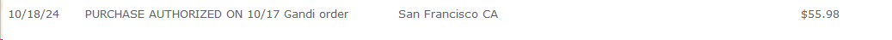
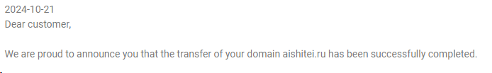
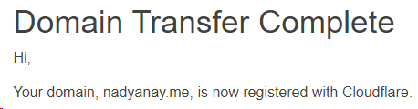

When leadership changes, enshittification is sure to follow. Especially if the company is a profitable company with an otherwise good reputation. The new owners will do everything they can to ruin it in an attempt to squeeze short-term profits. Gandi is now in competition with GoDaddy for being the worst possible registrar.

On October 17th I received an email from Gandi. My domain, the one you are reading this from right now, was renewed. A typical annual event for me. I thought nothing of it at the time. Later that night I had a look at my account balance, by chance mostly, as I do not routinely check it. That's when I saw this:

$55 for a domain renewal? My domain isn't worth that much! I hardly get any traffic on it and the TLD renewal fee is about $15/yr. For years Gandi has been about $17-$19/yr to renew (I forget the specifi camount if I am being honest). But first, we need to go back a little further... back to February 2023 when Gandi was acquired by Total Webhosting Solutions. I learned about this from [Hacker News](https://news.ycombinator.com/item?id=35080777) and though to myself: "Well, that sucks. I'll probably end up having to move registrars at some point."

After the purchase they removed their free email service - which I refuse to pay someone $5/mo for. I spitefully moved my email to self-host using [Mail-in-a-Box](https://mailinabox.email/). It still costs me $5/mo but I also get unlimited mailboxes and mailbox aliasing without having to pay for it. They also raised domain renewals by about 20% making them about the same price as more expensive registrars like GoDaddy and Namecheap. $22/yr renewal? A few dollars more than I was spending but not worth the hassle of moving away since other registrars charged about the same amount as well.

Which brings me back to $55.98 for a domain renewal. That is more than **double** and is in fact closer to **triple** what it should cost. They apparently announced this further increase at some point but I never saw the email for it before it was too late - automatic renewals cannot be refunded.

I have another domain with Gandi - so I thought how much are they going to charge me to renew [aishitei.ru](https://aishitei.ru) in May of next year? Turns out - another $54! What the **FUCK** Gandi‽ No. Absolutely not. Not paying that. I will move the heavens and do whatever I have to do to get the fuck away from Gandi at this point. I am not going to go from spending about $34~/yr on my domain renewals to $110~/yr.

One issue though - Russia is at war with Ukraine. As a result many of the registrars I wanted to move to had stopped supporting domains using the `.ru` TLD. So I couldn't use [Porkbun](https://porkbun.com/) which seems to be an up-and-coming "No bullshit" registrar. I ended up finding a registrar that supports `.ru` TLD and had a seemingly neutral reputation. So that domain has been moved to [Netim](https://www.netim.com/en), which happens to be another France-based registrar. My new renewal fee? $13 - and it was even free to transfer the domain to Netim! Transfering a domain typically has a cost associated to it (usually the renewal fee or slightly cheaper) so that was nice to see.

After a small  headache with RU-Center to get my NIC-REG updated from Gandi to Netim the transfer was complete. Netim is now responsible for my `aishtiei.ru` domain and, thankfully, I didn't take my email down in the process.

Next up was getting `nadyanay.me` moved. While I could have moved it to RU-Center I have personal reasons for not wishing to do so. `.me` has better support than a lot of registrars. I think my original plans were to go with Porkbun for this domain - but I ended up going with Cloudflare since they do renewals at-cost. While I do not support Cloudflare controlling what seems to be over half of the internet - I don't expect them to rugpull me like Gandi did.

Gandi could have continued making $34/yr from me for the rest of my life. Now they get $0/yr and what used to be my top recommendation for people looking to purchase a domain is now a warning to "avoid at all costs". They will never see another penny from me - either directly or indirectly. Their entire business strategy now is hoping people are either too lazy or lack the knowledge to move to another domain registrar. Don't be one of those people! Jump ship and save yourself the money.

I didn't write this blog only to vent. I wrote this blog on the off-chance it will help prevent someone else from signing up at Gandi and as a warning to my future self and others: if a company you trust is ever sold, be ready to abandon ship sooner than later. I knew the enshittification would happen eventually. What I didn't know was that it would happen as quickly as it did.
